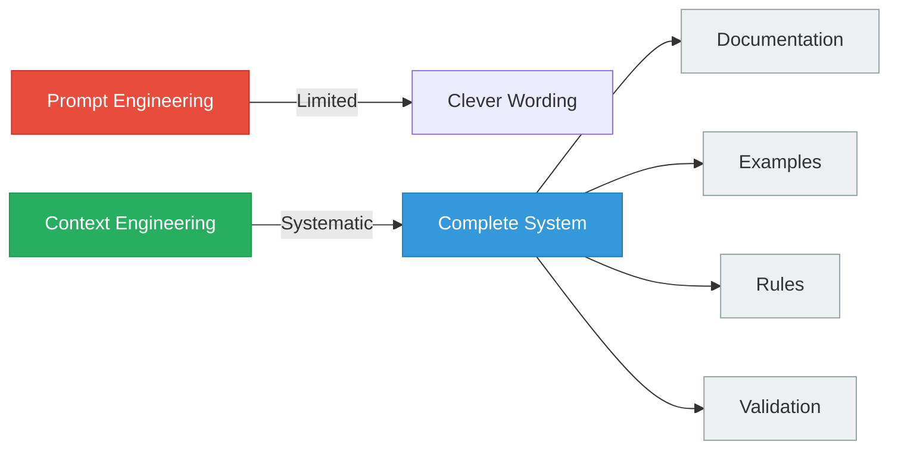
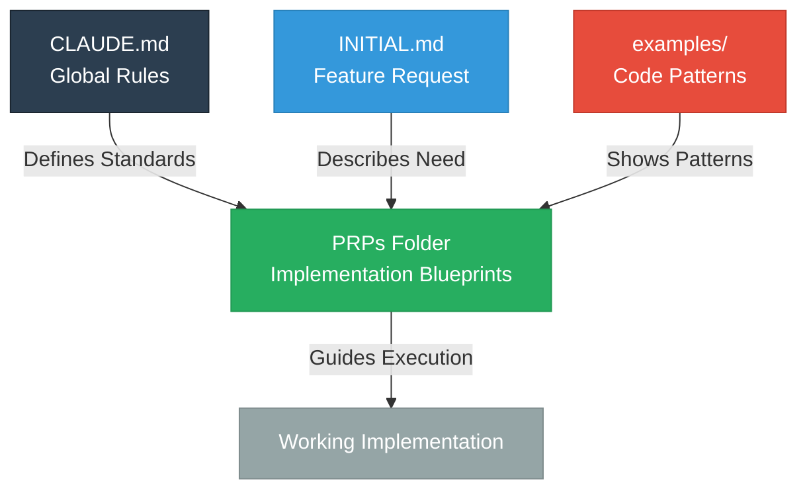
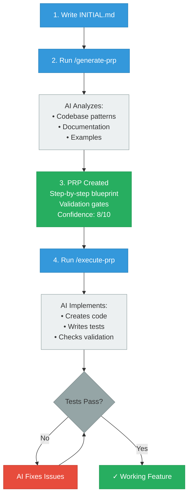
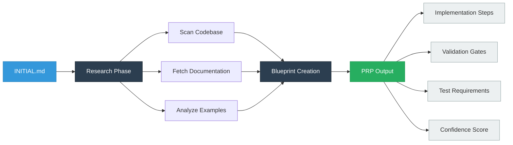
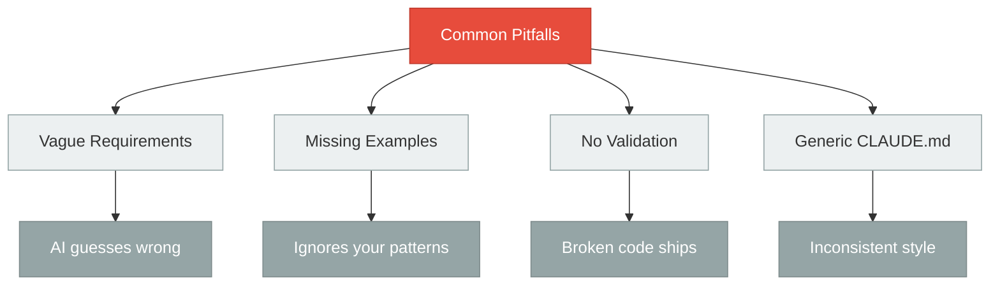
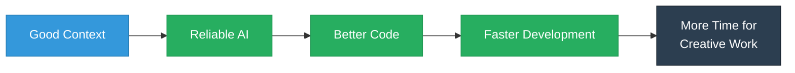

# Context Engineering: Building AI That Actually Works

**A 16-Minute Demo**
From Vibe Coding to Professional AI-Assisted Development

---

## SLIDE 1: The Context Crisis (90s)

### The Problem We All Face

```
Developer: "Build me an authentication system"
AI: *Creates basic login form*
Developer: "No, I meant OAuth2 with JWT, following our existing patterns..."
AI: *Completely different implementation*
Developer: "Wait, you're not using our database models..."
AI: *Starts over again...*
```

**The Hard Truth:**

> "Most AI agent failures aren't model failures—they're **context failures**"

### Why AI Coding Fails

| Problem | Result |
|---------|--------|
| Vague instructions | Generic, unusable code |
| Missing examples | Ignores project patterns |
| No validation | Broken code that "looks good" |
| Scattered context | Inconsistent implementations |

**Context Engineering solves all of this.**

---

## SLIDE 2: What is Context Engineering? (120s)

### The Paradigm Shift



### The Three Levels

| Approach | What It Is | Success Rate |
|----------|-----------|--------------|
| **Vibe Coding** | "Just make it work" casual requests | 10% |
| **Prompt Engineering** | Clever phrasing and wording tricks | 40% |
| **Context Engineering** | Systematic context + validation | 90%+ |

### Core Philosophy

**Context Engineering = Comprehensive Information + Validation Loops**

Not just *what* to build, but *how* to build it according to your standards.

---

## SLIDE 3: The Architecture (120s)

### Four Core Components



### Component Breakdown

| Component | Purpose | Contains |
|-----------|---------|----------|
| **CLAUDE.md** | Project-wide AI rules | Code style, testing requirements, conventions |
| **INITIAL.md** | Feature specification | Requirements, examples, docs, constraints |
| **PRPs/** | Implementation blueprints | Step-by-step plans with validation gates |
| **examples/** | Pattern library | Real code showing "the right way" |

### File Structure

```
your-project/
├── .claude/
│   └── commands/
│       ├── generate-prp.md    ← Research & blueprint creation
│       └── execute-prp.md     ← Implementation with validation
├── PRPs/
│   └── feature-name.md        ← Your implementation plans
├── examples/
│   ├── api-client-pattern.py
│   ├── test-example.py
│   └── error-handling.py
├── CLAUDE.md                  ← Your project rules
└── INITIAL.md                 ← Feature template
```

---

## SLIDE 4: The Workflow (150s)

### From Idea to Implementation



### The Magic of Self-Correction

**Validation Loop:** AI doesn't just write code—it validates, finds problems, and fixes them automatically.

---

## SLIDE 5: Crafting INITIAL.md (120s)

### The Four Essential Sections

```markdown
# INITIAL.md Template

## 1. FEATURE
Specific, comprehensive description with concrete requirements

## 2. EXAMPLES
References to code patterns in examples/ folder

## 3. DOCUMENTATION
API docs, library guides, schemas

## 4. OTHER CONSIDERATIONS
Auth requirements, rate limits, pitfalls, performance needs
```

### Good vs Bad Examples

| ❌ Bad (Vague) | ✅ Good (Specific) |
|----------------|-------------------|
| "Add authentication" | "Build OAuth2 authentication using our existing UserModel (examples/models.py), JWT tokens with 24hr expiry, refresh token rotation, and integrate with our Redis session store (see docs/redis-schema.md)" |
| "Make it fast" | "Implement caching with Redis, target <100ms API response time, use async/await patterns from examples/async-api.py" |
| "Add tests" | "Write pytest tests following examples/test_api.py pattern, achieve 90% coverage, mock external APIs using examples/mocking.py approach" |

### Power Technique: Liberal Example References

```markdown
## EXAMPLES
- `examples/api-client.py` - Shows our retry logic and error handling
- `examples/test-patterns.py` - Demonstrates our mocking approach
- `examples/database-models.py` - Our SQLAlchemy patterns
- `examples/async-handlers.py` - How we structure async operations
```

**More examples = Better results**

---

## SLIDE 6: PRP Generation Magic (120s)

### What Happens When You Run `/generate-prp INITIAL.md`



### PRP Output Structure

```markdown
# Product Requirements Prompt: [Feature Name]

## Research Summary
- Analyzed 47 files in codebase
- Found 3 similar patterns in examples/
- Reviewed FastAPI and SQLAlchemy documentation

## Implementation Steps
1. **Database Models** (examples/models.py pattern)
   - Create User table with auth fields
   - Validation: Run `alembic upgrade head`

2. **API Endpoints** (examples/api.py pattern)
   - POST /auth/login, /auth/refresh
   - Validation: `pytest tests/test_auth.py -v`

3. **JWT Token Service** (examples/services.py pattern)
   - Token generation with 24hr expiry
   - Validation: Unit tests must pass

## Confidence: 9/10
High confidence - clear examples, well-documented libraries
```

---

## SLIDE 7: 5 Golden Rules (120s)

### Best Practices for Success

| Rule | Why It Matters | Quick Win |
|------|----------------|-----------|
| **1. Be Explicit** | AI can't read your mind | Add "must use async/await" instead of assuming |
| **2. Show Examples** | AI learns from patterns | Create examples/ with 5-10 real code samples |
| **3. Use Validation** | Catch errors automatically | Add `pytest && mypy && ruff` to PRPs |
| **4. Link Documentation** | Ensures correct API usage | Include specific doc URLs in INITIAL.md |
| **5. Customize CLAUDE.md** | Consistency across features | Add your team's coding standards |

### Common Mistakes to Avoid



### The Power Law

**80% of success comes from 20% of effort:**
- Good INITIAL.md with examples
- Validation commands in PRP
- Clear CLAUDE.md rules

---

## SLIDE 8: See It In Action (90s)

### Real Example: Building a Web Scraper

#### INITIAL.md (Simplified)

```markdown
## FEATURE
Build async web scraper for e-commerce sites:
- Extract product name, price, availability
- Handle rate limiting (max 10 req/sec)
- Store in PostgreSQL using our schema
- Retry failed requests 3x with exponential backoff

## EXAMPLES
- examples/async-http-client.py - Our aiohttp patterns
- examples/database-models.py - SQLAlchemy setup
- examples/error-handling.py - Retry logic

## DOCUMENTATION
- BeautifulSoup4: https://www.crummy.com/software/BeautifulSoup/bs4/doc/
- aiohttp: https://docs.aiohttp.org/en/stable/

## CONSIDERATIONS
- Must respect robots.txt
- Handle dynamic JavaScript content
- Proxy rotation for large-scale scraping
```

#### Generated PRP (Excerpt)

```markdown
## Step 1: HTTP Client
Implement RateLimitedClient class using aiohttp
Pattern: examples/async-http-client.py
Validation: pytest tests/test_client.py::test_rate_limiting

## Step 2: Parser
BeautifulSoup parser with fallback for JS content
Validation: pytest tests/test_parser.py --cov=scraper.parser
Coverage target: 90%

## Step 3: Database Integration
SQLAlchemy async engine, Product model
Validation: alembic check && pytest tests/test_models.py
```

#### Execution Result

```
✓ HTTP client implemented with rate limiting
✓ Tests pass: 15/15
✓ Parser handles 3 content types
✓ Tests pass: 12/12
✓ Database models created
✓ Migration generated
✓ Integration tests pass: 8/8
✓ Coverage: 94%

Feature complete in 8 minutes
```

---

## SLIDE 9: Your Journey Starts Now (50s)

### Quick Start Checklist

- [ ] Clone [context-engineering-intro](https://github.com/coleam00/context-engineering-intro)
- [ ] Customize `CLAUDE.md` for your project
- [ ] Add 5-10 code examples to `examples/`
- [ ] Write your first `INITIAL.md`
- [ ] Run `/generate-prp INITIAL.md`
- [ ] Review the PRP
- [ ] Run `/execute-prp PRPs/your-feature.md`
- [ ] Watch the magic happen

### Resources

| Resource | Link |
|----------|------|
| **Repository** | github.com/coleam00/context-engineering-intro |
| **Documentation** | Check README.md and examples/ |
| **Tutorial** | See `ce-hands-on-tutorial.md` (post-demo) |

### Key Takeaway



> **"Context Engineering is 10x better than prompt engineering and 100x better than vibe coding"**

---

## Questions?

**Let's build AI systems that actually work.**

---

### Appendix: Color Reference

All Mermaid diagrams use this professional palette:
- Primary: `#2C3E50` (dark slate)
- Secondary: `#3498DB` (bright blue)
- Accent: `#E74C3C` (coral red)
- Success: `#27AE60` (emerald green)
- Neutral: `#95A5A6` (gray)
- Background: `#ECF0F1` (light gray)
