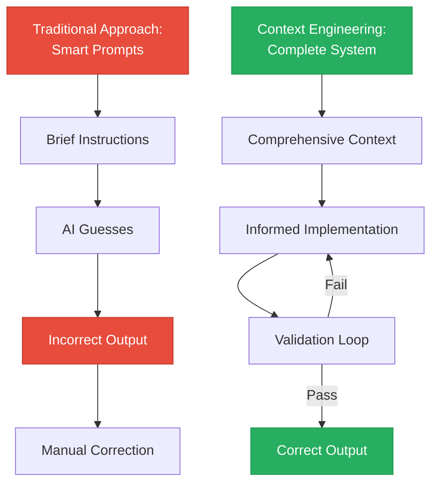

# Context Engineering: Hands-On Tutorial

**From Demo to Mastery**
A comprehensive guide to implementing Context Engineering in your projects

---

## Table of Contents

1. [Foundation: Understanding Context Engineering](#part-1-foundation)
2. [Setup: Your First Context Engineering Project](#part-2-setup)
3. [First Feature: Guided Implementation](#part-3-first-feature)
4. [Advanced Patterns: Complex Workflows](#part-4-advanced-patterns)
5. [Mastery: Building Your System](#part-5-mastery)

**Estimated Time:** 3-4 hours for complete tutorial
**Prerequisites:** Basic programming knowledge, Claude Code installed

---

## Part 1: Foundation (30 minutes)

### Learning Objectives
- Understand why traditional AI coding fails
- Grasp the mental model of Context Engineering
- Recognize the difference between prompts and context

### 1.1 The Problem Space

#### Exercise 1: Document Your AI Failures

Take 5 minutes to reflect on your recent AI coding experiences:

1. **List 3 times AI coding failed you**
   - What did you ask for?
   - What did AI deliver?
   - Where did it go wrong?

Example:
```
Ask: "Add authentication to my app"
Got: Generic login form that didn't use my database models
Problem: AI didn't know my project structure or conventions
```

**Insight to discover:** Most failures trace back to missing information, not bad AI.

#### Exercise 2: Categorize the Failures

For each failure above, identify what context was missing:

| Failure | Missing Context |
|---------|----------------|
| Example: Generic auth | Database schema, existing models, project patterns |
| Your failure 1: | |
| Your failure 2: | |
| Your failure 3: | |

**Key Realization:** If you had provided this context upfront, would AI have succeeded?

### 1.2 The Mental Model Shift

#### From Prompts to Context: A Framework



#### Exercise 3: Map the Analogy

Context Engineering is to AI coding as _______ is to traditional software development.

Think about:
- Architecture diagrams
- API documentation
- Code style guides
- Test specifications

**Answer:** Context Engineering is like providing complete technical specifications, not just a user story.

### 1.3 The Four Pillars Deep Dive

| Pillar | Purpose | Analogy | Example Content |
|--------|---------|---------|-----------------|
| **CLAUDE.md** | Project constitution | Company handbook | "Always use async/await", "Test coverage >90%", "Follow PEP 8" |
| **INITIAL.md** | Feature brief | Product requirements doc | "Build OAuth2 login using UserModel from models.py" |
| **PRPs/** | Implementation blueprint | Technical spec | "Step 1: Create endpoint. Validation: pytest passes" |
| **examples/** | Pattern library | Reference architecture | Working code showing "the right way" |

#### Exercise 4: Build Your Context Checklist

For a feature you want to build, what context would AI need?

```markdown
## My Feature: _________________

### Project Rules (CLAUDE.md)
- [ ] Code style requirements
- [ ] Testing expectations
- [ ] Framework/library preferences
- [ ] File organization conventions

### Feature Specification (INITIAL.md)
- [ ] Exact functionality needed
- [ ] Integration points with existing code
- [ ] Performance/security requirements
- [ ] Edge cases to handle

### Implementation Examples (examples/)
- [ ] Similar feature from codebase
- [ ] Testing pattern to follow
- [ ] Error handling approach
- [ ] API integration pattern

### Validation (PRP)
- [ ] Test commands that must pass
- [ ] Linting/type checking
- [ ] Coverage thresholds
- [ ] Integration test scenarios
```

### Checkpoint 1: Understanding Assessment

**Answer these questions** (answers at end of section):

1. Context Engineering primarily focuses on:
   a) Writing better prompts
   b) Providing comprehensive information systematically
   c) Using more powerful AI models
   d) Writing more code comments

2. The validation loop in Context Engineering:
   a) Runs once at the end
   b) Only checks syntax
   c) Automatically fixes failures until tests pass
   d) Requires manual intervention

3. Which component would contain "Always use TypeScript strict mode"?
   a) INITIAL.md
   b) PRP file
   c) CLAUDE.md
   d) examples/

**Answers:** 1-b, 2-c, 3-c

---

## Part 2: Setup (45 minutes)

### Learning Objectives
- Clone and configure Context Engineering template
- Customize CLAUDE.md for your project
- Create your first examples library
- Understand project structure

### 2.1 Project Initialization

#### Step 1: Clone the Template

```bash
# Clone the repository
git clone https://github.com/coleam00/context-engineering-intro.git my-ce-project
cd my-ce-project

# Examine the structure
ls -la
```

You should see:
```
.claude/
  commands/
    generate-prp.md
    execute-prp.md
PRPs/
  templates/
examples/
CLAUDE.md
INITIAL.md
README.md
```

#### Step 2: Install Claude Code

If you haven't already:
```bash
# Follow instructions at https://claude.com/claude-code
# Verify installation
claude --version
```

#### Step 3: Open in Claude Code

```bash
# Open the project
claude .
```

### 2.2 Customizing CLAUDE.md

This is your project's constitution. Every AI interaction will reference this file.

#### Exercise 5: Create Your CLAUDE.md

Open `CLAUDE.md` and customize it. Here's a template:

```markdown
# Project Context for AI Assistant

## Project Overview
[2-3 sentences about your project]
Technology stack: [Python/FastAPI, React, PostgreSQL, etc.]

## Code Organization
- **File Size:** Keep files under 300 lines; split into modules if larger
- **Module Structure:** One class per file, group related functions
- **Naming:** snake_case for Python, camelCase for JavaScript
- **Imports:** Group stdlib, third-party, local; alphabetize within groups

## Testing Requirements
- **Framework:** pytest (Python) / Jest (JavaScript)
- **Coverage:** Minimum 85% for new code
- **Test Location:** tests/ directory mirroring src/ structure
- **Naming:** test_*.py or *.test.js
- **Mocking:** Use pytest-mock / jest.mock for external dependencies

## Code Style
- **Python:** Follow PEP 8, use Black formatter, type hints required
- **JavaScript:** ESLint + Prettier, prefer const/let over var
- **Documentation:** Docstrings for all public functions/classes
- **Comments:** Explain "why", not "what"

## API Patterns
- **REST:** Use FastAPI with Pydantic models
- **Error Handling:** Return proper HTTP status codes, structured error responses
- **Validation:** Validate at API boundary
- **Authentication:** JWT tokens, refresh token rotation

## Database
- **ORM:** SQLAlchemy (async)
- **Migrations:** Alembic
- **Naming:** Plural table names, singular model names
- **Relationships:** Use explicit foreign keys

## Git Workflow
- **Branches:** feature/*, bugfix/*, hotfix/*
- **Commits:** Conventional commits (feat:, fix:, docs:, etc.)
- **Pull Requests:** Require tests and passing CI

## Performance
- **Async:** Use async/await for I/O operations
- **Caching:** Redis for session/frequently accessed data
- **Database:** Index foreign keys and frequently queried columns
- **Response Time:** Target <100ms for API endpoints

## Security
- **No Secrets:** Never commit credentials or API keys
- **Input Validation:** Sanitize all user inputs
- **SQL Injection:** Use parameterized queries only
- **CORS:** Configure properly for your domains
- **Rate Limiting:** Implement on all public endpoints

## Common Gotchas
- [Specific issues in your stack, e.g., "FastAPI background tasks need proper async handling"]
- [Framework-specific quirks]
- [Deployment considerations]

## Examples Location
Check `examples/` folder for reference implementations of common patterns.
```

#### Your Turn: Customize

1. **Replace placeholders** with your actual stack
2. **Add specific rules** from your team's conventions
3. **Include gotchas** you've learned the hard way
4. **Reference your documentation** (internal wikis, API docs)

**Time investment:** 20-30 minutes now saves hours later

### 2.3 Building Your Examples Library

The `examples/` folder is your AI's training dataset. Quality examples = quality output.

#### Exercise 6: Identify Patterns to Document

List 5-10 common patterns in your codebase:

1. _____________________ (e.g., "API endpoint with validation")
2. _____________________ (e.g., "Database model with relationships")
3. _____________________ (e.g., "Async service class")
4. _____________________ (e.g., "Unit test with mocks")
5. _____________________ (e.g., "Error handling wrapper")
6. _____________________
7. _____________________
8. _____________________
9. _____________________
10. _____________________

#### Step 4: Create Example Files

For each pattern, create a well-documented example file:

**Example: `examples/api_endpoint_pattern.py`**

```python
"""
Example API endpoint following project patterns.

This demonstrates:
- FastAPI endpoint structure
- Pydantic validation
- Database interaction
- Error handling
- Testing approach
"""

from fastapi import APIRouter, HTTPException, Depends
from pydantic import BaseModel, Field
from sqlalchemy.ext.asyncio import AsyncSession
from typing import Optional

from app.database import get_db
from app.models import User
from app.auth import get_current_user

router = APIRouter(prefix="/api/v1/users", tags=["users"])


class UserCreate(BaseModel):
    """Request model for creating a user."""
    email: str = Field(..., example="user@example.com")
    username: str = Field(..., min_length=3, max_length=50)
    full_name: Optional[str] = None


class UserResponse(BaseModel):
    """Response model for user data."""
    id: int
    email: str
    username: str
    full_name: Optional[str]

    class Config:
        from_attributes = True


@router.post("/", response_model=UserResponse, status_code=201)
async def create_user(
    user_data: UserCreate,
    db: AsyncSession = Depends(get_db)
):
    """
    Create a new user.

    Demonstrates:
    - Async database operations
    - Pydantic validation
    - Proper error handling
    - Response model mapping
    """
    # Check if user exists
    existing = await db.execute(
        select(User).where(User.email == user_data.email)
    )
    if existing.scalar_one_or_none():
        raise HTTPException(
            status_code=400,
            detail="User with this email already exists"
        )

    # Create user
    user = User(**user_data.model_dump())
    db.add(user)
    await db.commit()
    await db.refresh(user)

    return user


# Testing example for this endpoint
"""
# tests/test_api_users.py

import pytest
from httpx import AsyncClient
from sqlalchemy.ext.asyncio import AsyncSession

@pytest.mark.asyncio
async def test_create_user_success(client: AsyncClient, db: AsyncSession):
    response = await client.post(
        "/api/v1/users/",
        json={
            "email": "test@example.com",
            "username": "testuser",
            "full_name": "Test User"
        }
    )
    assert response.status_code == 201
    data = response.json()
    assert data["email"] == "test@example.com"
    assert "id" in data

@pytest.mark.asyncio
async def test_create_user_duplicate_email(client: AsyncClient, db: AsyncSession):
    # Create first user
    await client.post("/api/v1/users/", json={"email": "test@example.com", "username": "user1"})

    # Attempt duplicate
    response = await client.post("/api/v1/users/", json={"email": "test@example.com", "username": "user2"})
    assert response.status_code == 400
    assert "already exists" in response.json()["detail"]
"""
```

#### Your Turn: Create 5 Examples

Create example files for your top 5 patterns. Each should include:
- [ ] Complete working code
- [ ] Comprehensive docstrings
- [ ] Error handling
- [ ] Testing example (can be in comments)
- [ ] Comments explaining "why" decisions were made

**File naming:**
- `examples/[pattern]_pattern.py`
- `examples/[feature]_example.js`
- `examples/test_[pattern].py`

### 2.4 Setting Up INITIAL.md Template

Create a template you can copy for each new feature.

#### Exercise 7: Create Your Template

```markdown
# INITIAL.md Template
[Save this as INITIAL_TEMPLATE.md]

## FEATURE
[Describe the feature with specific requirements]

**What:** [What functionality are you building?]
**Why:** [What problem does this solve?]
**How:** [High-level approach]

### Requirements
- [ ] Requirement 1 (specific, measurable)
- [ ] Requirement 2
- [ ] Requirement 3

### Success Criteria
- [ ] Tests pass with >90% coverage
- [ ] API response time <100ms
- [ ] Handles error cases gracefully
- [ ] Follows project conventions

## EXAMPLES
[Link to relevant example files]

- `examples/[relevant_pattern].py` - Demonstrates [what pattern]
- `examples/[another_pattern].py` - Shows [what approach]
- `examples/test_[pattern].py` - Testing approach

## DOCUMENTATION
[Links to relevant documentation]

### Official Documentation
- [Library/Framework]: [URL]
- [Database]: [URL]
- [Tool]: [URL]

### Internal Documentation
- Architecture: [Link to docs]
- API Standards: [Link to wiki]
- Database Schema: [Link to schema]

## OTHER CONSIDERATIONS

### Performance
- [Specific requirements, e.g., "Must handle 1000 req/sec"]
- [Caching strategy]

### Security
- [Authentication requirements]
- [Data validation rules]
- [Rate limiting]

### Error Handling
- [Expected error scenarios]
- [How to handle failures]
- [Retry logic]

### Dependencies
- [New libraries needed]
- [Version constraints]

### Testing
- [Specific test scenarios]
- [Integration test requirements]
- [Mock data needs]

### Gotchas
- [Known issues to avoid]
- [Common mistakes]
- [Edge cases]
```

### Checkpoint 2: Setup Assessment

**Verify your setup:**

- [ ] CLAUDE.md customized with your project rules
- [ ] At least 5 example files created in examples/
- [ ] INITIAL_TEMPLATE.md ready to use
- [ ] Claude Code running successfully
- [ ] Can access /generate-prp and /execute-prp commands

**Test it:** Run `/help` in Claude Code and verify you see the custom commands.

---

## Part 3: First Feature (60 minutes)

### Learning Objectives
- Write a comprehensive INITIAL.md
- Generate your first PRP
- Execute and validate implementation
- Understand the feedback loop

### 3.1 Choose Your First Feature

Start with something **moderately complex** (not too simple, not too complex):

**Good First Features:**
- API endpoint with database CRUD operations
- Data validation service
- Background job processor
- Authentication middleware
- Report generator

**Avoid for first attempt:**
- "Hello World" (too simple to see benefits)
- Complete rewrite of major system (too complex)

#### Exercise 8: Define Your Feature

Use the INITIAL_TEMPLATE.md to write a complete feature specification.

**Example: Building a Task Management API**

```markdown
# Task Management API Endpoint

## FEATURE

Build a complete REST API for managing tasks with CRUD operations, assignment to users, status tracking, and filtering capabilities.

**What:** Task management endpoints that allow creating, reading, updating, and deleting tasks, with support for assigning tasks to users and filtering by status.

**Why:** Users need to manage tasks within the application with proper validation, error handling, and database persistence.

**How:** FastAPI endpoints with SQLAlchemy models, Pydantic validation, async database operations, and comprehensive testing.

### Requirements
- [ ] Create task with title, description, assignee, due_date, status
- [ ] Get single task by ID
- [ ] List all tasks with filtering (status, assignee, date range)
- [ ] Update task (partial updates allowed)
- [ ] Delete task (soft delete - mark as archived)
- [ ] Assign/unassign tasks to users
- [ ] Validate due dates are in future
- [ ] Return 404 for non-existent tasks
- [ ] Return 400 for invalid input

### Success Criteria
- [ ] All CRUD operations tested with >90% coverage
- [ ] API response time <50ms for single task, <200ms for list
- [ ] Proper HTTP status codes (200, 201, 404, 400, etc.)
- [ ] Input validation prevents invalid data
- [ ] Follows project API patterns from examples/

## EXAMPLES

- `examples/api_endpoint_pattern.py` - Shows FastAPI endpoint structure, Pydantic models, async DB operations
- `examples/database_model_pattern.py` - Demonstrates SQLAlchemy model with relationships
- `examples/test_api_pattern.py` - Testing approach with pytest-asyncio
- `examples/error_handling.py` - Proper exception handling and HTTP responses

## DOCUMENTATION

### Official Documentation
- FastAPI: https://fastapi.tiangolo.com/tutorial/sql-databases/
- Pydantic: https://docs.pydantic.dev/latest/concepts/models/
- SQLAlchemy (async): https://docs.sqlalchemy.org/en/20/orm/extensions/asyncio.html

### Internal Documentation
- Database Schema: docs/database-schema.md
- API Standards: docs/api-conventions.md

## OTHER CONSIDERATIONS

### Performance
- Use database indexes on task.status and task.assignee_id
- Implement pagination for list endpoint (max 100 items)
- Consider caching user lookups

### Security
- Validate user has permission to view/modify tasks
- Sanitize all string inputs to prevent injection
- Rate limit to 100 requests/minute per user

### Error Handling
- Return structured error responses: {"detail": "error message", "error_code": "TASK_NOT_FOUND"}
- Handle database connection failures gracefully
- Log errors for debugging

### Dependencies
- No new dependencies required (FastAPI, SQLAlchemy, Pydantic already in project)

### Testing
- Unit tests for each endpoint
- Test validation failures (missing required fields, invalid dates)
- Test edge cases (updating non-existent task, assigning to non-existent user)
- Integration test for full workflow: create → update → assign → delete

### Gotchas
- Remember to use async/await for all database operations
- Soft delete requires filtering archived tasks in list queries
- Due date validation should account for timezone
- Use PATCH for partial updates, not PUT
```

#### Your Turn: Write Your INITIAL.md

Spend 15-20 minutes writing a thorough INITIAL.md for your chosen feature.

**Checklist:**
- [ ] Feature description is specific and detailed
- [ ] All requirements are measurable
- [ ] Linked to at least 3 relevant examples
- [ ] Included relevant documentation URLs
- [ ] Listed security/performance considerations
- [ ] Identified potential gotchas

### 3.2 Generate Your PRP

#### Step 5: Run the Command

In Claude Code:
```
/generate-prp INITIAL.md
```

Watch what happens:
1. AI reads your INITIAL.md
2. Scans your codebase for patterns
3. Analyzes linked examples
4. Fetches documentation
5. Creates step-by-step implementation plan

**This may take 2-5 minutes** - AI is being thorough.

#### Step 6: Review the Generated PRP

The PRP will be saved to `PRPs/task-management-api.md` (or similar name).

**What to look for:**

```markdown
# Product Requirements Prompt: Task Management API

## Research Summary
✓ Analyzed 47 files in the codebase
✓ Found similar patterns in examples/api_endpoint_pattern.py
✓ Reviewed FastAPI and SQLAlchemy documentation
✓ Identified existing User model for relationships

## Implementation Plan

### Step 1: Database Model
**File:** `app/models/task.py`

Create Task model with:
- Fields: id, title, description, assignee_id, due_date, status, created_at, archived
- Relationship to User model
- Indexes on status and assignee_id

**Pattern Reference:** examples/database_model_pattern.py

**Validation Gate:**
```bash
alembic revision --autogenerate -m "Add Task model"
alembic upgrade head
pytest tests/test_models.py::test_task_model -v
```

### Step 2: Pydantic Schemas
**File:** `app/schemas/task.py`

Create:
- TaskCreate (input)
- TaskUpdate (partial input)
- TaskResponse (output)

**Pattern Reference:** examples/api_endpoint_pattern.py

**Validation Gate:**
```bash
pytest tests/test_schemas.py::test_task_schemas -v
```

### Step 3: CRUD Operations
**File:** `app/crud/task.py`

Implement async functions:
- create_task()
- get_task()
- get_tasks() with filtering
- update_task()
- delete_task() (soft delete)

**Pattern Reference:** examples/database_operations.py

**Validation Gate:**
```bash
pytest tests/test_crud_task.py -v --cov=app.crud.task --cov-report=term-missing
# Target: >90% coverage
```

### Step 4: API Endpoints
**File:** `app/api/v1/endpoints/tasks.py`

Implement routes:
- POST /tasks
- GET /tasks/{id}
- GET /tasks (with query params)
- PATCH /tasks/{id}
- DELETE /tasks/{id}

**Pattern Reference:** examples/api_endpoint_pattern.py

**Validation Gate:**
```bash
pytest tests/test_api_tasks.py -v
# All endpoint tests must pass
```

### Step 5: Integration Tests
**File:** `tests/test_integration_tasks.py`

Test complete workflows:
- Create → Read → Update → Delete
- Task assignment workflow
- Filtering and pagination

**Validation Gate:**
```bash
pytest tests/test_integration_tasks.py -v --cov=app --cov-report=html
# Target: 90%+ coverage
```

## Confidence Score: 9/10

**High confidence because:**
- Clear examples of all required patterns
- Well-documented libraries
- Explicit validation gates
- Similar features exist in codebase

**Potential challenges:**
- Soft delete filtering needs care in list queries
- Timezone handling for due dates
```

#### Exercise 9: PRP Review Checklist

Review your generated PRP against this checklist:

- [ ] **Research Summary** - Does AI show it understood your codebase?
- [ ] **Implementation Steps** - Are they logical and well-ordered?
- [ ] **Pattern References** - Does each step reference your examples?
- [ ] **Validation Gates** - Does each step have testable validation?
- [ ] **Confidence Score** - Is it >7? (If <7, consider improving INITIAL.md)
- [ ] **Challenges Noted** - Did AI identify potential issues?

**If anything looks wrong, edit the PRP before executing.** You're in control.

### 3.3 Execute the PRP

#### Step 7: Run Execution Command

```
/execute-prp PRPs/task-management-api.md
```

Watch AI work:
1. Creates todo list from PRP steps
2. Implements each step
3. Runs validation commands
4. Fixes any failures
5. Moves to next step

**This may take 10-20 minutes** depending on complexity.

#### Step 8: Observe the Process

You'll see output like:
```
✓ Created Task model in app/models/task.py
  Running validation: alembic revision --autogenerate -m "Add Task model"
  ✓ Migration created successfully

✓ Created Pydantic schemas in app/schemas/task.py
  Running validation: pytest tests/test_schemas.py::test_task_schemas -v
  ✗ Test failed: test_task_update_optional_fields

  Analyzing failure...
  Issue: Field validation too strict for partial updates
  Fixing: Making fields Optional in TaskUpdate schema

  Re-running validation: pytest tests/test_schemas.py::test_task_schemas -v
  ✓ All tests pass

[continues through all steps]
```

**This is the magic of Context Engineering:** AI self-corrects when validation fails.

### 3.4 Verify and Review

#### Step 9: Manual Testing

Even with automated tests passing, do a quick manual verification:

```bash
# Start your development server
uvicorn app.main:app --reload

# Test endpoints manually or with curl/httpie
curl -X POST http://localhost:8000/api/v1/tasks \
  -H "Content-Type: application/json" \
  -d '{
    "title": "Test task",
    "description": "Testing Context Engineering",
    "due_date": "2025-12-31T00:00:00Z"
  }'
```

#### Step 10: Review Generated Code

Open the files AI created. Check for:
- [ ] Code follows your CLAUDE.md conventions
- [ ] Matches patterns from examples/
- [ ] Includes proper error handling
- [ ] Has comprehensive tests
- [ ] Documentation/docstrings present

#### Exercise 10: Quality Assessment

Rate the generated code:

| Criterion | Score (1-5) | Notes |
|-----------|-------------|-------|
| Follows project conventions | | |
| Matches example patterns | | |
| Error handling | | |
| Test coverage | | |
| Code readability | | |
| Documentation | | |

**If score <4 on any criterion:** Identify what context was missing and update CLAUDE.md or examples.

### 3.5 Iteration and Improvement

#### Exercise 11: Reflect and Refine

1. **What worked well?**
   - Which examples were most helpful?
   - What parts of INITIAL.md were clearest?
   - Did validation catch real issues?

2. **What could improve?**
   - What examples should you add?
   - What rules should go in CLAUDE.md?
   - How could INITIAL.md be more specific?

3. **Update your Context Engineering setup:**
   - Add new examples based on what was generated
   - Refine CLAUDE.md with new insights
   - Update INITIAL_TEMPLATE.md

**The system gets better with each feature you build.**

### Checkpoint 3: First Feature Assessment

**Completion checklist:**

- [ ] INITIAL.md written with comprehensive context
- [ ] PRP generated with confidence >7/10
- [ ] PRP executed with validation passing
- [ ] Code generated follows project conventions
- [ ] Tests pass with adequate coverage
- [ ] Manual testing confirms functionality
- [ ] Lessons learned documented for next iteration

---

## Part 4: Advanced Patterns (60 minutes)

### Learning Objectives
- Handle complex multi-step features
- Integrate multiple systems
- Deal with external APIs and services
- Optimize Context Engineering workflow

### 4.1 Multi-Component Features

#### Exercise 12: Complex Feature Planning

**Scenario:** Build a real-time notification system that:
- Listens to database events
- Processes notifications through a queue
- Sends via email, SMS, and push notifications
- Stores notification history
- Provides user preferences UI

This requires coordination between:
- Database triggers
- Message queue (e.g., Celery/Redis)
- Email service (SendGrid)
- SMS service (Twilio)
- Push notification service (Firebase)
- Frontend components

#### Strategy: Break Down and Coordinate

**Step 1: Identify Components**

```markdown
# Notification System Components

## Backend Components
1. Database models (User preferences, Notification history)
2. Event triggers (Database change detection)
3. Queue workers (Celery tasks)
4. Service integrations (Email, SMS, Push)
5. API endpoints (Preferences CRUD, Notification history)

## Frontend Components
6. Preferences UI
7. Notification center component
8. Real-time updates (WebSocket/SSE)

## Infrastructure
9. Redis setup (queue + caching)
10. Message queue configuration
```

**Step 2: Create Multiple INITIAL.md Files**

Don't try to do everything in one PRP. Split logically:

```
INITIAL_notifications_database.md
INITIAL_notifications_queue.md
INITIAL_notifications_services.md
INITIAL_notifications_api.md
INITIAL_notifications_frontend.md
```

Each focused on one concern.

**Step 3: Define Integration Points**

In each INITIAL.md, specify how it connects to others:

```markdown
## FEATURE: Notification Queue Workers

[Description...]

## INTEGRATION POINTS

**Consumes from:**
- Database events via triggers (see INITIAL_notifications_database.md)
- Redis queue messages

**Produces to:**
- Email service API
- SMS service API
- Push notification service API

**Depends on:**
- `app/models/notification.py` (from database component)
- `app/services/email.py` (interface definition needed)

## EXAMPLES
- examples/celery_task_pattern.py
- examples/service_integration.py
- examples/retry_logic.py
```

#### Your Turn: Plan a Complex Feature

Choose a multi-component feature and:
1. Break it into 5-7 logical components
2. Define integration points between components
3. Determine build order (what depends on what)
4. Create separate INITIAL.md files for independent components

### 4.2 External API Integration

#### Exercise 13: Third-Party Service Integration

**Scenario:** Integrate with Stripe for payment processing.

**Challenge:** Official docs are comprehensive but generic. You need implementation that follows YOUR patterns.

#### Strategy: Combine Official Docs + Your Patterns

**Enhanced INITIAL.md structure:**

```markdown
# Stripe Payment Integration

## FEATURE
[Standard feature description...]

## EXAMPLES
- examples/external_api_client.py - HTTP client pattern with retry logic
- examples/webhook_handler.py - Webhook verification and processing
- examples/async_service_pattern.py - Service class structure

## DOCUMENTATION

### Official Stripe Documentation
- API Reference: https://stripe.com/docs/api
- Payment Intents: https://stripe.com/docs/payments/payment-intents
- Webhooks: https://stripe.com/docs/webhooks
- **Specific sections to reference:**
  - Creating Payment Intent: https://stripe.com/docs/api/payment_intents/create
  - Webhook signature verification: https://stripe.com/docs/webhooks/signatures

### Integration Guidelines
- Use official `stripe` Python library (v5.0+)
- Follow examples/external_api_client.py for error handling
- Implement webhook verification per official docs
- Store Stripe customer IDs in our User model (see examples/database_model_pattern.py)

## OTHER CONSIDERATIONS

### API Specifics
- API calls should be async (use stripe.aiohttp)
- Handle rate limiting (Stripe: 100 req/sec)
- Implement idempotency keys for payment creation
- Retry logic for network failures (3 attempts, exponential backoff)

### Webhooks
- Verify webhook signatures (security critical!)
- Handle duplicate webhook deliveries (idempotent processing)
- Respond to webhook within 5 seconds (process async if needed)
- Store raw webhook payload for debugging

### Security
- API keys in environment variables (NEVER commit)
- Use different keys for test/production
- Validate all amounts before sending to Stripe
- Log all payment events for audit trail

### Testing
- Use Stripe test mode and test cards
- Mock Stripe API calls in unit tests (see examples/mocking_external_apis.py)
- Test webhook handling with Stripe CLI
- Integration tests with test mode API keys

### Error Handling
- Stripe errors (card declined, insufficient funds, etc.)
- Network errors (timeouts, connection failures)
- Webhook signature failures
- **Specific errors to handle:**
  - CardError (card declined)
  - RateLimitError (too many requests)
  - InvalidRequestError (bad parameters)
  - APIConnectionError (network issues)
```

#### Key Technique: Example + Docs = Success

Create an example showing the pattern:

**`examples/stripe_payment_pattern.py`:**

```python
"""
Stripe payment integration pattern.

Demonstrates:
- Async Stripe API usage
- Error handling for specific Stripe errors
- Idempotency key usage
- Logging and audit trail
"""

import stripe
from stripe import error as stripe_errors
from typing import Optional
import logging
import uuid

from app.config import settings
from app.models import User, Payment

stripe.api_key = settings.STRIPE_SECRET_KEY
logger = logging.getLogger(__name__)


class StripePaymentService:
    """
    Service for handling Stripe payments.

    Follows our service pattern from examples/async_service_pattern.py
    """

    async def create_payment_intent(
        self,
        user: User,
        amount_cents: int,
        currency: str = "usd",
        idempotency_key: Optional[str] = None
    ) -> dict:
        """
        Create a Stripe Payment Intent.

        Args:
            user: User making the payment
            amount_cents: Amount in cents (e.g., 1000 = $10.00)
            currency: ISO currency code
            idempotency_key: Optional key for idempotent requests

        Returns:
            Payment intent data

        Raises:
            PaymentError: If payment creation fails
        """
        if not idempotency_key:
            idempotency_key = str(uuid.uuid4())

        try:
            # Create payment intent with Stripe
            intent = await stripe.PaymentIntent.create_async(
                amount=amount_cents,
                currency=currency,
                customer=user.stripe_customer_id,
                metadata={
                    "user_id": user.id,
                    "user_email": user.email
                },
                idempotency_key=idempotency_key
            )

            # Log successful creation
            logger.info(
                "Payment intent created",
                extra={
                    "payment_intent_id": intent.id,
                    "user_id": user.id,
                    "amount_cents": amount_cents
                }
            )

            return intent

        except stripe_errors.CardError as e:
            # Card was declined
            logger.warning(
                "Card declined",
                extra={
                    "user_id": user.id,
                    "decline_code": e.decline_code
                }
            )
            raise PaymentError(f"Card declined: {e.user_message}")

        except stripe_errors.RateLimitError:
            # Too many requests
            logger.error("Stripe rate limit exceeded")
            raise PaymentError("Service temporarily unavailable")

        except stripe_errors.InvalidRequestError as e:
            # Invalid parameters
            logger.error(
                "Invalid Stripe request",
                extra={"error": str(e), "user_id": user.id}
            )
            raise PaymentError("Payment configuration error")

        except stripe_errors.APIConnectionError:
            # Network error
            logger.error("Stripe API connection failed")
            raise PaymentError("Payment service unavailable")

        except Exception as e:
            # Unexpected error
            logger.exception("Unexpected payment error")
            raise PaymentError("Payment processing failed")


# Testing example
"""
# tests/test_stripe_integration.py

import pytest
from unittest.mock import AsyncMock, patch
import stripe

@pytest.mark.asyncio
async def test_create_payment_intent_success(user_factory):
    user = await user_factory(stripe_customer_id="cus_test123")

    # Mock Stripe API call
    with patch('stripe.PaymentIntent.create_async', new_callable=AsyncMock) as mock_create:
        mock_create.return_value = {
            "id": "pi_test123",
            "amount": 1000,
            "currency": "usd"
        }

        service = StripePaymentService()
        result = await service.create_payment_intent(user, 1000)

        assert result["id"] == "pi_test123"
        mock_create.assert_called_once()

@pytest.mark.asyncio
async def test_create_payment_intent_card_declined(user_factory):
    user = await user_factory()

    with patch('stripe.PaymentIntent.create_async', new_callable=AsyncMock) as mock_create:
        mock_create.side_effect = stripe.error.CardError(
            "Card declined",
            param=None,
            code="card_declined"
        )

        service = StripePaymentService()
        with pytest.raises(PaymentError, match="Card declined"):
            await service.create_payment_intent(user, 1000)
"""
```

Now when AI implements Stripe integration, it has:
- Official Stripe docs for API details
- Your project pattern for structure
- Your error handling approach
- Your testing approach

### 4.3 Handling Validation Failures

#### Exercise 14: Debugging Failed Validations

**Scenario:** Execution fails during validation:

```
Step 3: API Endpoints
✓ Created endpoints in app/api/v1/payments.py
Running validation: pytest tests/test_api_payments.py -v
✗ Test failed: test_create_payment_missing_amount

Expected: 400 Bad Request
Got: 500 Internal Server Error
```

#### Strategy: PRP Iteration

**Option 1: Let AI Fix It**
AI should automatically analyze and fix, but if it gets stuck:

```
In Claude Code:
"The test test_create_payment_missing_amount is failing because we're getting 500 instead of 400.
Check the validation in the endpoint and ensure missing fields return 400.
Reference examples/api_endpoint_pattern.py for proper validation."
```

**Option 2: Fix Manually and Update Context**
1. Fix the issue yourself
2. Add the corrected pattern to examples/
3. Update CLAUDE.md if it's a recurring issue

```markdown
## CLAUDE.md addition:

### API Validation
- **Always** validate request bodies using Pydantic models
- Missing required fields should return 400, not 500
- Validation errors should return structured response:
  ```json
  {"detail": [{"field": "amount", "message": "Field required"}]}
  ```
```

Now future features won't have this issue.

### 4.4 Optimizing Context Engineering Workflow

#### Exercise 15: Build Your CE Toolkit

Create reusable tools to speed up Context Engineering:

**1. INITIAL.md Generator Script**

```python
# scripts/new_feature.py
"""
Quick INITIAL.md generator from template.

Usage: python scripts/new_feature.py "Payment Integration"
"""

import sys
from pathlib import Path
from datetime import datetime

def create_initial_md(feature_name: str):
    template = Path("INITIAL_TEMPLATE.md").read_text()

    # Customize template
    content = template.replace("[FEATURE_NAME]", feature_name)
    content = content.replace("[DATE]", datetime.now().strftime("%Y-%m-%d"))

    # Save
    filename = f"INITIAL_{feature_name.lower().replace(' ', '_')}.md"
    Path(filename).write_text(content)
    print(f"Created {filename}")

if __name__ == "__main__":
    create_initial_md(sys.argv[1])
```

**2. Example File Template**

```python
# scripts/new_example.py
"""
Create template for new example file.

Usage: python scripts/new_example.py api_client
"""

import sys
from pathlib import Path

TEMPLATE = '''"""
{name} - Example Pattern

Demonstrates:
- [Key concept 1]
- [Key concept 2]
- [Key concept 3]

Pattern reference for Context Engineering.
"""

# Your example code here


# Testing Example
"""
# tests/test_{name}.py

import pytest

def test_{name}():
    # Test implementation
    pass
"""
'''

def create_example(name: str):
    content = TEMPLATE.format(name=name)
    filename = f"examples/{name}_pattern.py"
    Path(filename).write_text(content)
    print(f"Created {filename}")

if __name__ == "__main__":
    create_example(sys.argv[1])
```

**3. Context Checklist Script**

```bash
#!/bin/bash
# scripts/ce_check.sh
# Verify Context Engineering setup before running /generate-prp

echo "🔍 Context Engineering Pre-Flight Check"
echo ""

# Check CLAUDE.md exists and is not empty
if [ ! -s "CLAUDE.md" ]; then
    echo "❌ CLAUDE.md missing or empty"
    exit 1
else
    echo "✓ CLAUDE.md exists"
fi

# Check examples/ has files
EXAMPLE_COUNT=$(find examples/ -type f -name "*.py" | wc -l)
if [ "$EXAMPLE_COUNT" -lt 3 ]; then
    echo "⚠️  Only $EXAMPLE_COUNT examples found (recommend 5+)"
else
    echo "✓ $EXAMPLE_COUNT example files found"
fi

# Check INITIAL.md exists
if [ ! -f "INITIAL.md" ]; then
    echo "❌ INITIAL.md not found"
    exit 1
else
    echo "✓ INITIAL.md exists"

    # Check for key sections
    if grep -q "## EXAMPLES" INITIAL.md; then
        echo "  ✓ Has EXAMPLES section"
    else
        echo "  ⚠️  Missing EXAMPLES section"
    fi

    if grep -q "## DOCUMENTATION" INITIAL.md; then
        echo "  ✓ Has DOCUMENTATION section"
    else
        echo "  ⚠️  Missing DOCUMENTATION section"
    fi
fi

echo ""
echo "✅ Context Engineering setup looks good!"
```

### Checkpoint 4: Advanced Patterns Assessment

**Can you:**

- [ ] Break complex features into coordinated components
- [ ] Combine official documentation with your patterns
- [ ] Handle and debug validation failures
- [ ] Iterate and improve context based on results
- [ ] Use automation to speed up CE workflow

---

## Part 5: Mastery (45 minutes)

### Learning Objectives
- Build domain-specific pattern libraries
- Scale Context Engineering across teams
- Measure and optimize success rates
- Become a Context Engineering expert

### 5.1 Building Domain-Specific Libraries

#### Exercise 16: Create Pattern Collections

Organize examples by domain:

```
examples/
├── api/
│   ├── crud_endpoint.py
│   ├── pagination.py
│   ├── filtering.py
│   └── authentication.py
├── database/
│   ├── model_relationships.py
│   ├── migrations.py
│   ├── complex_queries.py
│   └── async_operations.py
├── services/
│   ├── external_api_client.py
│   ├── email_service.py
│   ├── file_upload.py
│   └── caching.py
├── testing/
│   ├── unit_test_pattern.py
│   ├── integration_test.py
│   ├── mocking.py
│   └── fixtures.py
└── infrastructure/
    ├── celery_task.py
    ├── docker_setup.py
    └── ci_cd_pipeline.yml
```

**Strategy:** When AI generates good code, add it to examples/

#### Your Turn: Categorize Your Examples

1. Review all examples you've created
2. Organize into logical categories
3. Ensure each category has 3-5 solid examples
4. Document the category structure in `examples/README.md`

### 5.2 Team Collaboration Patterns

#### Exercise 17: Shared Context Engineering Setup

**For teams using Context Engineering:**

**1. Central Repository Structure**

```
team-context-engineering/
├── CLAUDE_BASE.md          # Org-wide standards
├── CLAUDE_PROJECT.md       # Project-specific rules
├── examples/
│   ├── frontend/
│   ├── backend/
│   ├── mobile/
│   └── shared/
├── PRPs/
│   ├── templates/
│   │   ├── api_feature.md
│   │   ├── ui_component.md
│   │   └── database_migration.md
│   ├── in_progress/
│   └── completed/
└── docs/
    ├── context-engineering-guide.md
    └── best-practices.md
```

**2. CLAUDE.md Inheritance**

```markdown
# CLAUDE_PROJECT.md

## Include Base Rules
[Read and follow all rules from CLAUDE_BASE.md]

## Project-Specific Additions
[Project-specific rules here]
```

**3. Example Contribution Guidelines**

```markdown
# examples/CONTRIBUTING.md

## Adding New Examples

### Criteria
- [ ] Solves a real problem from the project
- [ ] Follows existing code conventions
- [ ] Includes comprehensive docstrings
- [ ] Has corresponding test example
- [ ] Reviewed by at least one team member

### Process
1. Create example file in appropriate category
2. Add docstring explaining what it demonstrates
3. Include inline comments for "why" decisions
4. Add test example (can be in comment block)
5. Submit PR with "example" label
6. Link to from team wiki/docs

### Naming Convention
`[domain]_[pattern]_pattern.py`

Examples:
- api_pagination_pattern.py
- database_soft_delete_pattern.py
- service_retry_logic_pattern.py
```

#### Exercise 18: Knowledge Sharing

**Create a "Pattern of the Week" process:**

1. Each week, one team member creates/improves an example
2. Present to team in 10-minute session
3. Add to examples/ library
4. Document in team wiki

**Benefits:**
- Examples library grows steadily
- Team alignment on patterns
- Knowledge sharing
- CE system gets better for everyone

### 5.3 Measuring Success

#### Exercise 19: Track Context Engineering Metrics

**Key Metrics to Monitor:**

| Metric | How to Measure | Target |
|--------|---------------|--------|
| **PRP Confidence Score** | Average confidence in generated PRPs | >8/10 |
| **First-Attempt Success** | % of features working without manual fixes | >80% |
| **Time to Implementation** | From INITIAL.md to working feature | <1 hour for medium features |
| **Test Coverage** | Coverage of AI-generated code | >90% |
| **Code Review Issues** | Issues found in review of AI code | <3 per feature |

**Create a tracking sheet:**

```markdown
# Context Engineering Success Log

## Feature: Task Management API
- Date: 2025-01-15
- PRP Confidence: 9/10
- First Attempt Success: Yes
- Time: 45 minutes
- Test Coverage: 94%
- Review Issues: 1 (missing error message)
- **Lessons Learned:** Added error message examples to examples/

## Feature: Payment Integration
- Date: 2025-01-18
- PRP Confidence: 7/10
- First Attempt Success: No (webhook signature validation failed)
- Time: 80 minutes
- Test Coverage: 88%
- Review Issues: 2
- **Lessons Learned:** Created examples/webhook_verification.py, updated CLAUDE.md with webhook patterns

## Trends
- Average confidence: 8.5/10
- Success rate: 85%
- Coverage: 91% average
```

#### Your Turn: Create Your Metrics Dashboard

Track your next 5 features using Context Engineering and identify patterns:
- Which features have highest confidence?
- Where do failures occur?
- What context additions correlate with success?

### 5.4 Advanced Context Engineering Techniques

#### Exercise 20: Context Layering

**Technique:** Provide context at multiple levels of specificity.

**Example: Building a Reporting Feature**

**Layer 1: CLAUDE.md (Global)**
```markdown
## Reporting Standards
- All reports must support PDF and CSV export
- Use Jinja2 templates for report formatting
- Cache report results for 5 minutes
- Implement pagination for large datasets
```

**Layer 2: examples/report_base_pattern.py (Pattern)**
```python
"""Base pattern for all reports in the system."""

class BaseReport:
    """
    Abstract base class for reports.

    All reports should inherit from this and implement:
    - generate_data()
    - get_template()
    """
    # ... implementation
```

**Layer 3: INITIAL.md (Specific)**
```markdown
## FEATURE: Sales Report

Inherit from examples/report_base_pattern.py
Use examples/pdf_generation.py for PDF export
Follow caching strategy from examples/report_caching.py

Specific requirements:
- Group by product category
- Show revenue trends (daily, weekly, monthly)
- Highlight top 10 products
```

**Result:** AI has context at right level of abstraction.

#### Exercise 21: Progressive Enhancement

**Technique:** Start simple, add complexity incrementally.

**Phase 1: Core Functionality**
```markdown
# INITIAL_sales_report_v1.md

## FEATURE
Generate basic sales report with:
- Total revenue
- Number of transactions
- Average order value

[Keep it simple first]
```

After successful implementation:

**Phase 2: Enhanced Version**
```markdown
# INITIAL_sales_report_v2.md

## FEATURE
Enhance sales report with:
- Product category breakdown
- Time-based trends
- Export functionality

## EXAMPLES
- PRPs/sales_report_v1.md (completed implementation to build upon)
- examples/report_enhancement.py

[Build on working foundation]
```

**Benefits:**
- Lower risk of failure
- Faster iteration
- Working feature sooner
- Each phase adds to examples

### 5.5 Troubleshooting Guide

#### Common Issues and Solutions

**Issue 1: Low Confidence Scores (<6/10)**

**Causes:**
- Insufficient examples
- Vague requirements
- Missing documentation

**Solutions:**
- Add 2-3 more relevant examples
- Specify exact technologies and approaches
- Link to official docs for libraries

**Issue 2: AI Ignores Project Patterns**

**Causes:**
- Examples not clearly linked in INITIAL.md
- CLAUDE.md rules too generic
- Examples don't match actual need

**Solutions:**
- Explicitly reference specific example files
- Make CLAUDE.md rules more specific (show code snippets)
- Create example that exactly matches the pattern needed

**Issue 3: Tests Fail Repeatedly**

**Causes:**
- Validation commands unclear
- Test environment issues
- Missing test fixtures/mocks

**Solutions:**
- Provide exact test commands with all flags
- Include test environment setup in examples
- Create examples/test_fixtures.py

**Issue 4: Generated Code Doesn't Match Style**

**Causes:**
- CLAUDE.md style rules too vague
- No style examples provided
- Conflicting examples

**Solutions:**
- Show code snippet examples in CLAUDE.md
- Run formatter on all examples
- Audit examples for consistency

### 5.6 The Context Engineering Mindset

#### Exercise 22: Reflection and Growth

**Questions to ask yourself regularly:**

1. **"What context did I assume AI knew?"**
   - Make implicit knowledge explicit
   - Document tribal knowledge

2. **"What examples would have prevented this issue?"**
   - Turn problems into examples
   - Build pattern library organically

3. **"How can I make this reusable?"**
   - Generalize solutions
   - Create templates

4. **"What validation would catch this earlier?"**
   - Add validation gates
   - Improve test patterns

**The Goal:** Shift from "fixing AI mistakes" to "improving context quality."

### Final Exercise: Your Context Engineering System

**Create your own Context Engineering methodology document:**

```markdown
# My Context Engineering System

## Philosophy
[Your approach to Context Engineering]

## Project Setup Checklist
- [ ] Step 1
- [ ] Step 2
- [ ] etc.

## CLAUDE.md Template
[Your base template]

## Example Categories
[Your organization system]

## INITIAL.md Templates
[For different feature types]

## Validation Standards
[Your testing requirements]

## Metrics and Goals
[What you measure and target]

## Lessons Learned
[Running log of insights]
```

### Graduation: You're a Context Engineer

**You've learned:**
- ✅ The mental model of Context Engineering
- ✅ How to set up comprehensive context
- ✅ Writing effective INITIAL.md files
- ✅ Generating and executing PRPs
- ✅ Advanced patterns for complex features
- ✅ Team collaboration approaches
- ✅ Measurement and continuous improvement

**Next steps:**
1. Apply Context Engineering to your next 5 features
2. Build your examples library to 20+ patterns
3. Track metrics and refine your process
4. Share your success with your team
5. Contribute back to the Context Engineering community

---

## Appendix A: Quick Reference

### Context Engineering Checklist

**Before Starting a Feature:**
- [ ] CLAUDE.md is current and comprehensive
- [ ] Relevant examples exist in examples/
- [ ] Documentation links are ready
- [ ] Validation commands are known

**Writing INITIAL.md:**
- [ ] Feature description is specific and detailed
- [ ] Requirements are measurable
- [ ] Links to 3+ relevant examples
- [ ] Includes documentation URLs
- [ ] Lists security/performance considerations
- [ ] Identifies potential gotchas

**Reviewing Generated PRP:**
- [ ] Research summary shows understanding
- [ ] Implementation steps are logical
- [ ] Each step references examples
- [ ] Validation gates are testable
- [ ] Confidence score >7/10
- [ ] Challenges are noted

**After Execution:**
- [ ] All tests pass
- [ ] Code follows conventions
- [ ] Manual testing confirms functionality
- [ ] Good patterns added to examples/
- [ ] Lessons learned documented

---

## Appendix B: Resources

### Official Resources
- Repository: https://github.com/coleam00/context-engineering-intro
- Claude Code: https://claude.com/claude-code

### Community
- Share your Context Engineering setup
- Contribute example patterns
- Discuss best practices

### Further Learning
- Advanced PRP techniques
- Context Engineering for specific frameworks
- Team workflows and governance
- CI/CD integration

---

## Appendix C: Example Collection

### Starter Examples to Create

**Essential Patterns (Create These First):**
1. `examples/api_endpoint_pattern.py` - Basic REST endpoint
2. `examples/database_model_pattern.py` - SQLAlchemy/ORM model
3. `examples/test_pattern.py` - Unit test structure
4. `examples/error_handling.py` - Exception handling
5. `examples/async_pattern.py` - Async/await usage

**Intermediate Patterns:**
6. `examples/authentication.py` - Auth flow
7. `examples/pagination.py` - Paginated responses
8. `examples/external_api_client.py` - Third-party integration
9. `examples/caching.py` - Cache strategy
10. `examples/background_task.py` - Queue/async task

**Advanced Patterns:**
11. `examples/complex_query.py` - Database optimization
12. `examples/file_upload.py` - File handling
13. `examples/websocket.py` - Real-time communication
14. `examples/data_migration.py` - Schema changes
15. `examples/monitoring.py` - Logging and metrics

---

**Congratulations! You're now equipped to implement Context Engineering in your projects. Remember: good context in, great code out.**
